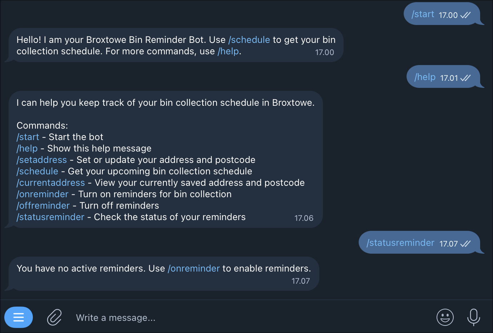

# broxtowe-bin-bot
A Telegram bot that keep track of the user's bin collection schedule.

Users can register their address, view upcoming collection dates, and receive automatic reminders one day before their scheduled pickup.

This bot scrapes live data from the **Broxtowe Borough Council** website, stores user preferences, and delivers notifications through Telegram.



## Features

- /start — Welcome message
- /help — Full list of commands
- /schedule — Retrieve your next upcoming bin collection
- /setaddress — Register your postcode + address
- /currentaddress — View your saved address
- /onreminder — Turn on daily reminders (one day before collection)
- /offreminder — Disable reminders
- /statusreminder — Check active reminder jobs

## Installation

### 1. Clone repository
```
git clone https://github.com/melvinkisam/broxtowe-bin-bot.git
```
### 2. Create virtual environment (if needed)
```
python -m venv venv
```
Then activate:
```
source venv/bin/activate   # macOS/Linux
venv\Scripts\activate      # Windows
```
### 3. Install dependencies
```
pip install -r requirements.txt
```
### 4. Adjust `.env`
Rename `.env.example` to `.env` and enter bot API and username:
```
BOT_API=YOUR_TELEGRAM_BOT_TOKEN
BOT_USERNAME=@yourbotusername

...
```

### 5. Set up BotFather

BotFather is the official Telegram bot used to create and manage other bots.

To run this project, you first need to create your own Telegram bot and obtain an API token (search for “BotFather” in Telegram or click on https://t.me/BotFather).

### Run code
Make sure you are on the directory of the `main.py` and then run:
```
python main.py
```